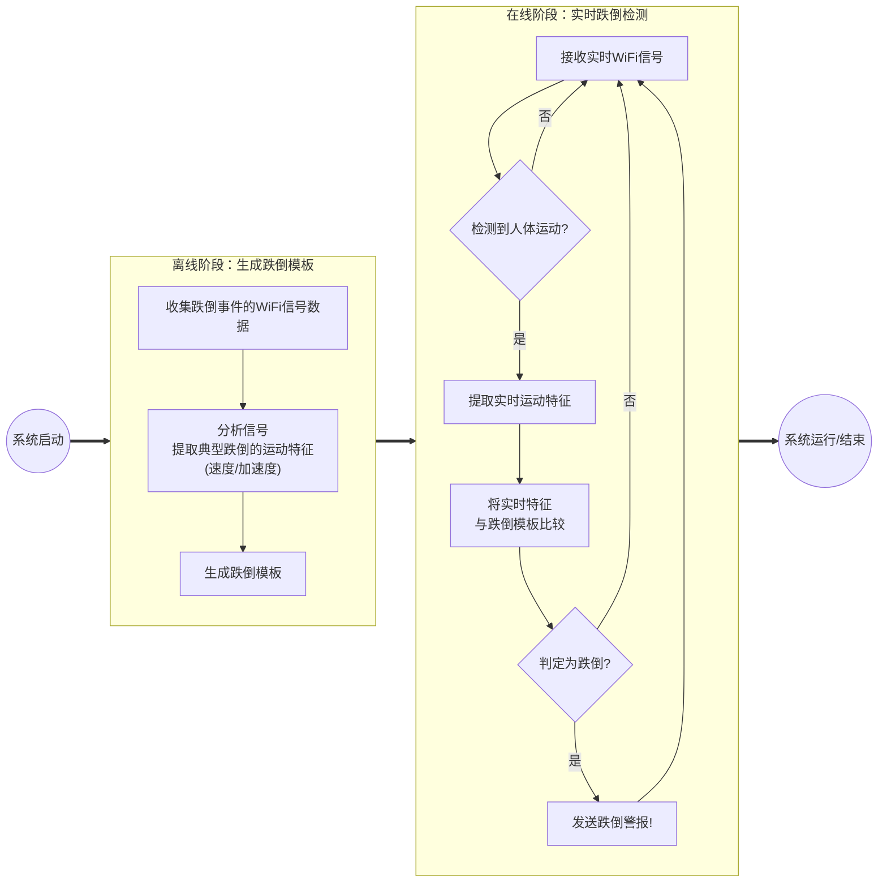

2、生成论文后，删除每段开头规律性的总分结构的句子
3、批量去掉首先，其次，此外，同时，然后，最后，综上所述，总之等这些每段开头很明显重复的转接词，并对零散段落进行合并。
4、对重复出现的词语进行同义词替换，确保语义准确。
5、对部分机械化重复论述的句子进行精简润色。
6、删除无关紧要的专业词汇或名词解释，并在适当的地方进行扩写，如通过举例使论文内容更丰富。
7、使用长句替代短句，短句加主语改长句，短段落合并变长段落。避免重复词语，提高可读性。
8、重点关注并改写检测报告标记的高风险句子，使其变为低风险或无风险状态。

